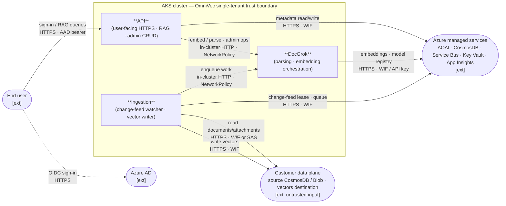
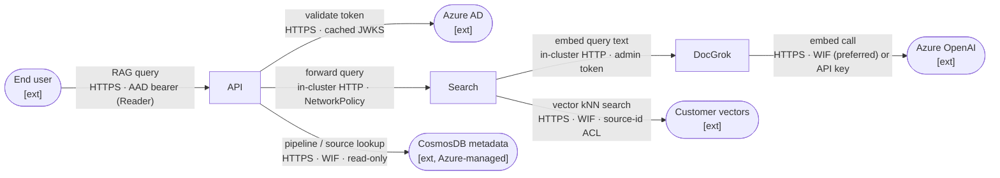
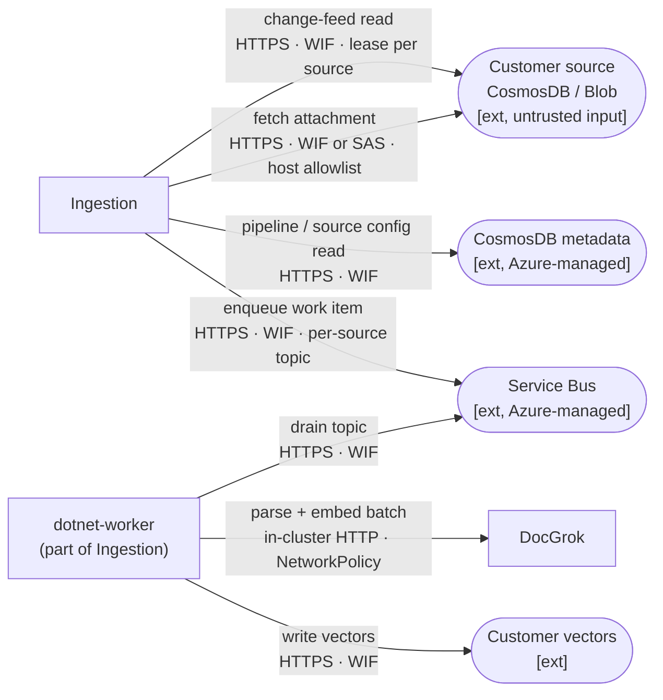
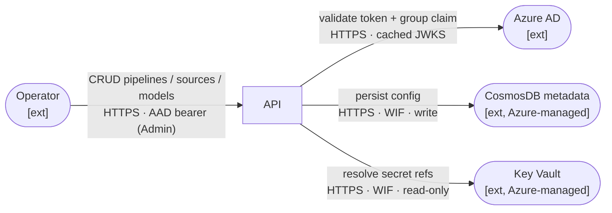

# OmniVec Threat Model

| Field | Value |
|---|---|
| Owner | OmniVec Team |
| Last reviewed | 2026-05-11 |
| Methodology | STRIDE-at-boundaries, manually identified (per DPSS / SQL Security Review Board guidance) |
| Companion artifact | [`threat-model.tm7`](./threat-model.tm7) — open in [Microsoft Threat Modeling Tool](https://aka.ms/threatmodelingtool); **TMT auto-threat-generation is intentionally disabled** (Settings → Disable Threat Generation) |
| Companion (CI/CD) | [`cicd-threat-model.md`](./cicd-threat-model.md) |
| Latest review notes | [`threat-model-review-2026-05.md`](./threat-model-review-2026-05.md) |

---

## 0. Threat Model Information

Documents assumptions that are not visible on the diagrams.

### 0.1 Deployment & operating model

- **Single-tenant.** One customer = one AKS cluster + one set of Azure data-plane resources. There is no shared OmniVec backplane and no cross-tenant traffic.
- **Customer is operator.** The customer (or their operator) deploys via Helm, configures Azure resources, and owns the cluster's day-2 operations (upgrades, patching, scaling).
- **Logical, not physical.** Diagrams in this document are **logical** views of trust relationships. Pod replicas, node pools, AZ topology, and Helm release naming are deployment concerns and are intentionally omitted.

### 0.2 Identity assumptions

- End users authenticate to **Azure AD** (customer's tenant). OmniVec validates JWTs against AAD JWKS; no local user database.
- **Workload Identity Federation (WIF)** is the default auth between AKS pods and Azure managed services (CosmosDB, AOAI, Service Bus, Key Vault). Pods present federated tokens; no Azure access keys in pod env.
- A long-lived `OMNIVEC_ADMIN_TOKEN` exists as a **breakglass** path only; production deployments are expected to rely on AAD groups → roles.

### 0.3 Networking assumptions

- All public ingress goes through an **HTTPS-terminating ingress controller** (NGINX or AKS Application Gateway). Plain `LoadBalancer` Services are not used in production (search Service defaults to `ClusterIP`; see T-SRCH-1).
- In-cluster traffic is **plain HTTP** today. The `networkPolicy.enabled=true` toggle activates default-deny + per-component allow rules (see T-NET-1). mTLS / service-mesh is roadmap.
- Customer data-plane endpoints (CosmosDB, Blob) are reached over HTTPS via the public Azure backbone; Private Endpoints are supported but not required.

### 0.4 Customer assumptions

- Customer **owns** their source CosmosDB / Blob and the destination vector store. Schemas, attachment names, MIME types, and blob URLs in their data are treated as **untrusted input** by OmniVec.
- Customer is responsible for hardening *their* CosmosDB / Blob accounts (firewall, RBAC, data classification). OmniVec only assumes it can reach them.
- Customer configures `attachment_blob_account_allowlist` (storage-account hostnames OmniVec is permitted to fetch from). Misconfiguration = open SSRF (see T-CON-2).

### 0.5 What this model does NOT cover

| Out of scope | Why |
|---|---|
| CI/CD supply chain | Has its own model: [`cicd-threat-model.md`](./cicd-threat-model.md) |
| Helm chart / Bicep infra | Operator concern; tracked under `infra/` review |
| Code-level vulns (SQLi, XSS, deserialization) | Covered by SDL / CodeQL / SAST policy |
| Operational SIEM / alerting design | Handled by AppInsights consumer team |
| Customer's hardening of their CosmosDB / Blob | Customer responsibility (we assume *they* did it) |
| Pod replicas, node-pool / AZ layout | Deployment concern; not a security-design risk in a single-tenant cluster |

---

## 1. Scope

OmniVec is a **single-tenant** retrieval-augmented vector platform that ingests customer documents, generates embeddings, and serves search/RAG. See §0 for deployment, identity, networking, and customer assumptions.

**In scope for this threat model:**
- Cluster-internal services (web, api, search, ingestor, dotnet-worker, docgrok router/pipeline-worker, in-cluster embedders)
- Trust boundaries crossed by user, customer data, and Azure managed services
- Bootstrap/admin authentication and AAD integration
- Inter-component data plane

**Out of scope:** see §0.5.

## 2. What we're working on — high-level view

**One diagram, ≤10 shapes, logical view.** Boxes are *logical components* (not pods, not Helm releases). Trust boundaries are red dashed lines. External interactors (outside our security responsibility) are marked `[ext]` with a justification in §0.5.



> **What this view shows**: the four trust crossings (User→API, In-cluster, OmniVec→Azure, OmniVec→Customer) and which components touch which boundary. Detailed flows are split into scenario diagrams in §3.

**Components**

| Component | Responsibility | Untrusted input from |
|---|---|---|
| **API** | User-facing HTTP surface; assistant RAG; admin CRUD on pipelines/sources | Internet (TB-1) |
| **DocGrok** | Embedding + parsing of customer documents; routes to in-cluster or AOAI embedders | Customer documents (via Ingestion) |
| **Ingestion** | Watches customer Cosmos / Blob, fetches attachments, dispatches to DocGrok, writes vectors | Customer Cosmos / Blob (TB-4) |

**Trust boundaries**

| Id | Boundary | Threat-model relevance |
|---|---|---|
| TB-1 | Internet ↔ API | Public HTTPS surface; AAD as identity provider |
| TB-2 | Inter-component within cluster | Plain HTTP today; cross-component compromise = lateral movement (mitigated by NetworkPolicy) |
| TB-3 | AKS ↔ Azure managed services | Workload Identity Federation (HTTPS + AAD), not key-based |
| TB-4 | OmniVec ↔ customer data plane | Customer data is **untrusted** (schemas, attachment names, MIME types, blob URLs) |

## 3. Scenario diagrams

Per reviewer guidance: scenario-focused, request flows only (responses omitted unless they cross a new boundary), two-line labels (purpose / how secured), authorization noted.

### 3.1 Scenario A — Search / RAG (read path)

> **Authorization:** all flows from user require an AAD bearer in the `Reader` or `Admin` group. Search results are filtered by source-id ACL.



### 3.2 Scenario B — Ingestion (write path)

> **Authorization:** Ingestion runs unattended under a workload identity. There is no end-user authorization on this path; the customer's RBAC on their own CosmosDB / Blob *is* the authorization boundary.



### 3.3 Scenario C — Admin / Configuration

> **Authorization:** all flows require AAD bearer in the `Admin` group (or breakglass `OMNIVEC_ADMIN_TOKEN`, audit-logged). Admin token is residual risk T-API-1.




## 4. Assets

| Asset | Sensitivity | Where it lives |
|---|---|---|
| Customer document content | **High** (may be PII) | Customer Blob → AKS RAM (transient) |
| Vector embeddings of customer content | **High** (PII-derived; partially invertible) | Customer destination (`e2eblob.vectors`) |
| AOAI API keys (legacy) | **High** | `omnivec.metadata.docgrok_model.api_key` — being removed in favor of AAD |
| `OMNIVEC_ADMIN_TOKEN` | **High** | Pod env var; long-lived; breakglass-only after AAD migration |
| AAD JWT signing keys (JWKS) | High | Microsoft tenant — out of OmniVec control |
| Workload-identity federated credential | High | UAMI; rotated by AKS |
| Pipeline / model definitions | Medium | `omnivec.metadata` |
| Service Bus messages (blob URLs + IDs) | Medium | Service Bus |

## 5. What can go wrong (top 10 design threats)

Selected manually at boundary crossings. Risk rating uses the SDL scale: **Critical / Important / Moderate / Low / DefenseInDepth**. *Status*: ✅ shipped · ⚠️ partial · ❌ open.

| Id | Boundary | STRIDE | Threat | Risk | Status | Mitigation & residual |
|---|---|---|---|---|---|---|
| **T-API-1** | TB-1 → API | S/E/R | Static admin bearer token grants full admin; no rotation, no per-call audit | **Important** | ✅ | AAD bearer + group→role mapping; admin token now breakglass-only. Residual: rotation runbook needed. |
| **T-MET-1** | API/DocGrok → metadata | I/T | AOAI API keys stored cleartext in metadata Cosmos | **Important** | ✅ | AAD-only model records; legacy keys purged. Residual: legacy fallback path still readable. |
| **T-PWK-1** | TB-4 → DocGrok | D/E | Malicious customer document crashes parser or escapes via Pillow/PyMuPDF CVE | **Important** | ⚠️ | Subprocess sandbox with `RLIMIT_*` behind `DOCGROK_PARSER_SANDBOX=1`. Residual: seccomp-bpf not enforced; flag default-off. |
| **T-CON-2** | TB-4 → Ingestion (SSRF) | T/I | Customer attachment URL points at attacker storage account | **Important** | ✅ | `attachment_blob_account_allowlist` mandatory; URL host pinned. Residual: relies on operator config. |
| **T-CON-1** | TB-2 (Ingestion lease) | T/D | Change-feed lease container shares Cosmos DB with metadata; cross-write can DoS | **Moderate** | ✅ | Optional dedicated lease account. Residual: not enabled by default. |
| **T-VEC-1** | TB-4 (data at rest) | I | Vectors are PII-derived, partially invertible (embedding-inversion); residency obligations apply | **Moderate** | ✅ | PII classification documented; `DELETE /api/sources/{id}/vectors` cascade-purge. Residual: must propagate to data agreements. |
| **T-RL-1** | TB-3 (DocGrok → AOAI) | D | One pipeline saturates AOAI tier RPM → 429 cascade starves others | **Moderate** | ✅ | Per-deployment embed semaphore + jittered backoff. Residual: no circuit-breaker. |
| **T-SRCH-1** | TB-1 → API (search) | I/T | Search endpoint was exposed via plain-HTTP `LoadBalancer` | **Important** | ✅ | Default `ClusterIP`; new `searchIngress` template provides TLS-terminating ingress. |
| **T-NET-1** | TB-2 (in-cluster) | S/T/I | No NetworkPolicy / mTLS — compromised pod can call any service unauth | **Moderate** | ✅ | Default-deny + per-component allow rules behind `networkPolicy.enabled`. Residual: mTLS / mesh roadmap. |
| **T-SUP-1** | Pre-cluster (image source) | T | Compromised registry / MITM swaps an OmniVec image | **Moderate** | ⚠️ | Cosign keyless signing on every push. Residual: admission verification (Ratify/Kyverno) not enforced by default. |

> The CI/CD pipeline itself (the GitHub Actions runner that produces those signatures) has its own threat model in [`cicd-threat-model.md`](./cicd-threat-model.md).

## 6. What we did about it (mitigation backlog)

Open items only — closed items are the ✅ rows above.

| Threat | Action | Owner | ETA |
|---|---|---|---|
| T-PWK-1 | Switch `DOCGROK_PARSER_SANDBOX` default to `1`; ship seccomp-bpf profile and require it via PSA `restricted` | DocGrok / OmniVec | next batch |
| T-SUP-1 | Add Ratify or Kyverno admission-controller chart that requires cosign signature on every OmniVec image | OmniVec | follow-up |
| T-API-1 (residual) | Document admin-token rotation runbook + deletion-after-AAD-cutover policy | OmniVec | follow-up |
| T-NET-1 (residual) | mTLS or service-mesh between tiers (defence in depth on top of NetworkPolicy) | OmniVec | follow-up |

## 7. Did we do enough? (review log)

| Date | Reviewer | Outcome | Notes |
|---|---|---|---|
| 2026-05-06 | Internal | Initial STRIDE-per-element pass | See `threat-model.md.bak` (pre-DPSS-refactor structure) |
| 2026-05-11 | Internal (DPSS-style refactor) | Trimmed to 10 boundary threats; collapsed DFD; surfaced T-SRCH-1, T-NET-1, T-SUP-1 from inter-component audit | Ready for SQL Security Review Board submission |
| 2026-05-11 | Internal (T-SRCH-1, T-NET-1 closure) | Search default switched to `ClusterIP` + new `searchIngress` template; `templates/networkpolicy.yaml` adds default-deny + per-tier allow rules behind `networkPolicy.enabled` toggle | Both threats now ✅ |
| 2026-05-11 | Reviewer feedback (Curzi-style) | Restructured: added §0 *Threat Model Information* (deployment / identity / networking / customer assumptions), replaced single complex DFD with one ≤10-shape high-level view + 3 scenario diagrams (Search, Ingestion, Admin), two-line flow labels (`purpose` / `how secured`), authorization noted per scenario, external interactors marked `[ext]` with justifications, response flows omitted | Doc now matches DPSS readability guidance |

**To request a Threat Model Review:** upload `threat-model.tm7` + this `.md` via the Threat Modeling Portal ([aka.ms/dpgtrack](https://aka.ms/dpgtrack)). Per DPSS guidance, the review meeting is a 2–3 hour call; this document is sized to fit.

## 8. How to update this model

1. Edit this file. Diff is the source of truth; `.tm7` is the visualization.
2. If the architecture changes, update the high-level view in §2 *and* the affected scenario diagram in §3.
3. Regenerate `.tm7` with `python scripts/gen_threat_model_tm7.py`.
4. Add new boundary threats to §5 with id `T-XXX-N` and a risk rating from the SDL scale.
5. Update §7 review log on every formal review or material refactor.

---

## Appendix A — Detailed DFD (19 elements, archived)

> **Note:** This view is preserved for historical context only. The high-level view in §2 plus the 3 scenario diagrams in §3 are the **current** source for `.tm7`. Per reviewer feedback, the doc no longer relies on a single dense diagram.

```mermaid
flowchart LR
  subgraph "INTERNET / AAD trust boundary"
    user["End-user browser"]
    aad["Azure AD<br/>(login.microsoftonline.com)"]
  end

  subgraph "AKS cluster (omnivec namespace)"
    subgraph "Web / API tier"
      web["omnivec-web<br/>(Next.js)"]
      api["omnivec-api<br/>(FastAPI)"]
      search["omnivec-search<br/>(Go)"]
    end
    subgraph "DocGrok tier"
      router["docgrok-router<br/>(Rust)"]
      pworker["docgrok-pipeline-worker"]
      incluster["in-cluster embedders<br/>CLIP / BGE / DSE-Qwen2"]
    end
    subgraph "Ingestor tier (.NET)"
      ingestor["omnivec-ingestor (.NET)<br/>change-feed watcher"]
      dotnetworker["omnivec-dotnet-worker<br/>(Service Bus consumer)"]
    end
  end

  subgraph "Azure managed services"
    aoai["Azure OpenAI"]
    cmeta["CosmosDB<br/>omnivec.metadata"]
    kv["Azure Key Vault"]
    sb["Azure Service Bus"]
    appinsights["Azure Monitor<br/>App Insights"]
  end

  subgraph "Customer-owned (external trust)"
    csrc["Customer CosmosDB<br/>(source w/ attachments)"]
    bsrc["Customer Blob source"]
    cvec["Customer CosmosDB<br/>(vectors destination)"]
    blob["Customer Blob<br/>(attachments source)"]
  end

  user -->|HTTPS + Bearer token| web
  user -->|HTTPS + Bearer token| api
  api -->|JWKS fetch (cached)| aad
  web --> api
  web --> search
  api --> cmeta
  api --> kv
  api --> sb
  api --> router
  search --> cvec
  search -->|/embed (query)| router
  search --> cmeta
  router -->|API key OR AAD| aoai
  router --> incluster
  router --> cmeta
  router --> pworker
  pworker --> sb
  pworker --> bsrc
  pworker -->|fetch attachment binary| blob
  pworker --> router
  pworker --> cvec
  ingestor -->|change-feed read| csrc
  ingestor -->|fetch attachment binary| blob
  ingestor -->|enumerate (azure-blob source)| bsrc
  ingestor -->|pipeline / source config read| cmeta
  ingestor -->|enqueue work (queue mode)| sb
  ingestor -->|"/embed/batch (inline mode)"| router
  ingestor -->|vector patch (inline mode)| csrc
  dotnetworker -->|drain SB topic| sb
  dotnetworker -->|"/embed/batch (queue mode)"| router
  dotnetworker -->|vector write| cvec
  dotnetworker -->|model record read| cmeta
  api -->|telemetry| appinsights
  search -->|telemetry| appinsights
  ingestor -->|telemetry| appinsights
  dotnetworker -->|telemetry| appinsights
```

## Appendix B — Prior STRIDE-per-element analysis (archive)

The previous version of this document (kept at `threat-model.md.bak` in the repo
working tree, also visible in git history before commit replacing it) contained
exhaustive STRIDE rows per process, per data store, and per external interactor.
That format was flagged by reviewers as **too detailed and lacking clarity from
a security-design standpoint** — most rows duplicated SDL/CodeQL coverage
rather than calling out boundary risks specific to OmniVec.

The 10 threats in §5 are the curated subset of those rows that represent
*design risk that STRIDE-at-boundaries surfaces and SDL/CodeQL does not*. If you
need the historical per-element matrix for context, see `threat-model.md.bak`.
