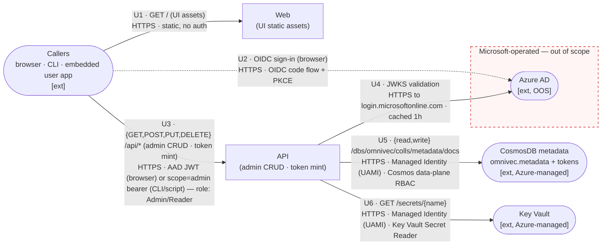
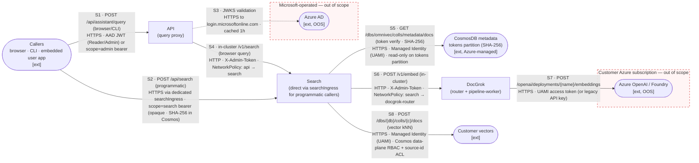

# OmniVec Threat Model

| Field | Value |
|---|---|
| Owner | OmniVec Team |
| Last reviewed | 2026-05-11 |
| Methodology | STRIDE-at-boundaries, manually identified (per DPSS / SQL Security Review Board guidance) |
| Companion artifact | [`threat-model.tm7`](./threat-model.tm7) — open in [Microsoft Threat Modeling Tool](https://aka.ms/threatmodelingtool); **TMT auto-threat-generation is intentionally disabled** (Settings → Disable Threat Generation) |
| Companion (CI/CD) | [`cicd-threat-model.md`](./cicd-threat-model.md) |
| Latest review notes | [`threat-model-review-2026-05.md`](./threat-model-review-2026-05.md) |

---

## 0. Threat Model Information

Documents assumptions that are not visible on the diagrams.

### 0.1 Deployment & operating model

- **Single-tenant.** One customer = one AKS cluster + one set of Azure data-plane resources. There is no shared OmniVec backplane and no cross-tenant traffic.
- **Customer is operator.** The customer (or their operator) deploys via Helm, configures Azure resources, and owns the cluster's day-2 operations (upgrades, patching, scaling).
- **Logical, not physical.** Diagrams in this document are **logical** views of trust relationships. Pod replicas, node pools, AZ topology, and Helm release naming are deployment concerns and are intentionally omitted.

### 0.2 Identity assumptions

- End users authenticate to **Azure AD** (customer's tenant). OmniVec validates JWTs against AAD JWKS; no local user database.
- **Workload Identity Federation (Managed Identity (UAMI))** is the default auth between AKS pods and Azure managed services (CosmosDB, AOAI, Service Bus, Key Vault). Pods present federated tokens; no Azure access keys in pod env.
- A long-lived `OMNIVEC_ADMIN_TOKEN` exists as a **breakglass** path only; production deployments are expected to rely on AAD groups → roles.

### 0.3 Networking assumptions

- All public ingress goes through an **HTTPS-terminating ingress controller** (NGINX or AKS Application Gateway). Plain `LoadBalancer` Services are not used in production (search Service defaults to `ClusterIP`; see T-SRCH-1).
- In-cluster traffic is **plain HTTP** today. The `networkPolicy.enabled=true` toggle activates default-deny + per-component allow rules (see T-NET-1). mTLS / service-mesh is roadmap.
- Customer data-plane endpoints (CosmosDB, Blob) are reached over HTTPS via the public Azure backbone; Private Endpoints are supported but not required.

### 0.4 Customer assumptions

- Customer **owns** their source CosmosDB / Blob and the destination vector store. The customer trusts their own data; what OmniVec must defend against is **content-level risk** — a third party (an end user, an upstream system) can place a malicious document (crafted PDF/Office/image) into the customer's Blob, or set an attachment URL pointing at an attacker-controlled storage account. Our parsers and SSRF guards must therefore treat document bytes and blob URLs as hostile content (see T-PWK-1, T-CON-2 in §5).
- Customer is responsible for hardening *their* CosmosDB / Blob accounts (firewall, RBAC, data classification). OmniVec only assumes it can reach them.
- Customer configures `attachment_blob_account_allowlist` (storage-account hostnames OmniVec is permitted to fetch from). Misconfiguration = open SSRF (see T-CON-2).

### 0.5 What this model does NOT cover

| Out of scope | Why |
|---|---|
| **Azure AD / Microsoft Entra ID** (identity provider) | Microsoft-operated service in the customer's tenant. OmniVec only *consumes* it: validates JWTs against the public JWKS endpoint and reads group claims. We do not run, secure, configure, or rotate keys for AAD — Microsoft does. Shown on diagrams because the API talks to it, but the security of AAD itself (sign-in protection, conditional access, key rotation, tenant configuration) is Microsoft's + the customer tenant admin's responsibility. |
| **Azure AI Foundry / Azure OpenAI** (consumed by DocGrok) | Lives in the **customer's** Azure subscription. OmniVec only consumes it as a service over HTTPS+AAD; we have no control over the model deployment, content filters, network ACLs, or RBAC on the resource. Shown on diagrams (DocGrok calls it) but the security of the resource itself is the customer's responsibility. |
| CI/CD supply chain | Has its own model: [`cicd-threat-model.md`](./cicd-threat-model.md) |
| Helm chart / Bicep infra | Operator concern; tracked under `infra/` review |
| Code-level vulns (SQLi, XSS, deserialization) | Covered by SDL / CodeQL / SAST policy |
| Operational SIEM / alerting design | Handled by AppInsights consumer team |
| Customer's hardening of their CosmosDB / Blob | Customer responsibility (we assume *they* did it) |
| Pod replicas, node-pool / AZ layout | Deployment concern; not a security-design risk in a single-tenant cluster |

---

## 1. Scope

OmniVec is a **single-tenant** retrieval-augmented vector platform that ingests customer documents, generates embeddings, and serves search/RAG. See §0 for deployment, identity, networking, and customer assumptions.

**In scope for this threat model:**
- Cluster-internal services (web, api, search, ingestor, dotnet-worker, docgrok router/pipeline-worker, in-cluster embedders)
- Trust boundaries crossed by user, customer data, and Azure managed services
- Bootstrap/admin authentication and AAD integration
- Inter-component data plane

**Out of scope:** see §0.5.

## 2. What we're working on — high-level view

**One diagram, 5 shapes, logical view.** Everything OmniVec owns is collapsed into a single black box. Trust boundaries are red dashed lines. External interactors (outside our security responsibility) are marked `[ext]` with a justification in §0.5. Per-component breakdowns live in §3 scenarios.

```mermaid
flowchart LR
  callers(["Callers<br/>browser · CLI · embedded user app<br/>[ext]"])

  subgraph msft["Microsoft-operated — out of scope"]
    aad(["Azure AD<br/>(identity provider)<br/>[ext, OOS]"])
  end

  omnivec["**OmniVec**<br/>(API · Search · DocGrok · Ingestion)<br/>single-tenant in customer AKS"]

  subgraph custsub["Customer Azure subscription — out of scope"]
    foundry(["Azure OpenAI / Foundry<br/>[ext, OOS]"])
  end

  customer(["Customer data plane<br/>source CosmosDB / Blob · vectors destination<br/>[ext]"])

  callers -->|"queries · admin · token-mint<br/>HTTPS · AAD bearer (browser/CLI) or scope=search bearer (embedded app)"| omnivec
  callers -.->|OIDC sign-in<br/>HTTPS| aad
  omnivec -.->|JWT validation (JWKS fetch)<br/>HTTPS · public| aad
  omnivec -->|"embed call (consume only)<br/>HTTPS · Managed Identity (UAMI) or API key"| foundry
  customer -->|"read source documents/attachments · change-feed<br/>HTTPS · Managed Identity (UAMI) or SAS · host allowlist"| omnivec
  omnivec -->|"write embeddings/vectors<br/>HTTPS · Managed Identity (UAMI) · destination CosmosDB / pgvector"| customer

  style msft fill:#fff5f5,stroke:#c00,stroke-dasharray: 5 5
  style custsub fill:#fff5f5,stroke:#c00,stroke-dasharray: 5 5
```

> **What this view shows**: the only things OmniVec interacts with — Callers, AAD, customer's Azure OpenAI, and the customer data plane. Everything inside OmniVec (API, Search, DocGrok, Ingestion) is a black box at this level; per-component breakdowns live in §3 scenarios.

**Components**

| Component | Responsibility | Receives external content from |
|---|---|---|
| **OmniVec (black box)** | API + Search + DocGrok + Ingestion. Validates AAD JWTs (browser/CLI) and opaque `scope=search` bearer tokens (embedded apps). Calls Azure OpenAI to embed; reads/writes the customer data plane. | Callers (TB-1) and Customer documents (TB-4) |

**Trust boundaries**

| Id | Boundary | Threat-model relevance |
|---|---|---|
| TB-1 | Internet ↔ API | Public HTTPS surface to OmniVec (in scope). AAD itself sits *outside* this boundary as a Microsoft-operated external interactor — out of scope; only token validation is in scope. |
| TB-2 | Inter-component within cluster | Plain HTTP today; cross-component compromise = lateral movement (mitigated by NetworkPolicy) |
| TB-3 | AKS ↔ Azure managed services | Workload Identity Federation (HTTPS via Managed Identity), not key-based |
| TB-4 | OmniVec ↔ customer data plane | Customer-supplied document content and attachment URLs may originate from a third party; parser must assume hostile content (T-PWK-1) and SSRF guard the URL host (T-CON-2) |

## 3. Scenario diagrams

Four views, each focused on a distinct audience. Per reviewer guidance: request flows only (responses omitted unless they cross a new boundary), two-line labels (purpose / how secured), authorization noted. Each scenario is followed by a **Flow Details** table that documents per-flow purpose, transport, authentication, authorization, data sensitivity, and applied mitigations.

| # | View | Audience | What it shows | What it hides |
|---|---|---|---|---|
| **3.1** | Overall (5-shape) | Exec / SQL board | OmniVec as a black box vs. its 4 external interactors | All internals |
| **3.2** | User control plane | App-sec / API reviewers | Callers, AAD, Web, API, metadata, Key Vault — admin CRUD, token mint, sign-in, secret resolve | Search, Ingestion, DocGrok, Foundry |
| **3.3** | Search read path | App-sec / API reviewers | Browser-side search via API **and** programmatic search via `searchIngress`; embed hop to DocGrok / Foundry | Ingestion, dotnet-worker, customer source data |
| **3.4** | Ingestion / embedding data plane | Data-plane / SRE reviewers | Customer source → Ingestor → Service Bus → dotnet-worker → DocGrok → Foundry → customer vectors | Callers, AAD, Web, API |

### 3.1 Overall (high-level view)

The 5-shape black-box diagram is in **§2 above** — it is the canonical overall view. The three remaining diagrams below zoom into the OmniVec black box from three different angles.

### 3.2 User control plane (admin CRUD · token mint · sign-in)

> **Audience:** anyone reviewing the user-facing control surface — who can sign in, what they can change, and where config / token records live. Search is *not* on this diagram (see §3.3).
>
> **Authorization:** admin CRUD and token-mint endpoints (`POST/GET/DELETE /api/auth/tokens`, `POST/PUT/DELETE /api/{pipelines,sources,models}`) require `role=admin` — obtainable via AAD JWT in the `Admin` group, an opaque `scope=admin` bearer, or the breakglass `OMNIVEC_ADMIN_TOKEN`. Read-only endpoints require `Reader`.



**Flow details — User control plane**

| # | Purpose | Transport | AuthN | AuthZ | Data on the wire | Mitigations (refs §5) |
|---|---|---|---|---|---|---|
| **U1** | Browser fetches static UI assets | HTTPS (TLS 1.2+) terminated at NGINX | None (static) | n/a | HTML/JS/CSS | DefenseInDepth: CSP header set by web image |
| **U2** | Browser-only OIDC sign-in against tenant AAD | HTTPS to `login.microsoftonline.com` | OIDC authorization-code flow + PKCE | Tenant admin defines conditional access, MFA, group membership | Auth code → JWT (Bearer) | AAD itself is OOS (§0.5) |
| **U3** | Caller invokes admin CRUD / token mint endpoints | HTTPS (TLS 1.2+) terminated at NGINX ingress | AAD JWT (browser) or opaque `scope=admin` bearer (CLI/script); JWT validated against tenant JWKS — signature, `aud`, `iss`, `exp` | AAD group claim `Admin` or `Reader`; token-mint endpoints require `role=admin` | Config payloads (refs to secrets only); new-token plaintext (returned **once** at mint) | T-API-1 (AAD enforced; admin token = breakglass; audit log) |
| **U4** | API verifies the user's JWT signature against Microsoft's signing keys | HTTPS to `login.microsoftonline.com` (egress) | JWKS endpoint (public); response cached 1 h with `Cache-Control` honored | n/a | JWKS keys (public) | DefenseInDepth: optional cert pin via env var |
| **U5** | API persists/reads config records (pipelines, sources, model records, hashed tokens) | HTTPS to Azure Cosmos endpoint | Managed Identity (UAMI) | Cosmos data-plane RBAC; **read/write** on `omnivec.metadata`; tokens stored as SHA-256 hashes only | Config records (refs to secrets only), token records (hashed) | T-MET-1 (no key material in records; tokens hashed-at-rest) |
| **U6** | API resolves secret references at runtime (never stores secret values) | HTTPS to Key Vault | Managed Identity (UAMI) | Key Vault RBAC; **get** scope on a named secret | Secret value (in-memory only) | T-MET-1 |

### 3.3 Search read path (browser + programmatic)

> **Audience:** anyone reviewing the read/RAG surface. Shows both query entry points — **browser/CLI via the API** (AAD JWT or `scope=admin` bearer) and **programmatic via the dedicated `searchIngress`** (`scope=search` opaque bearer) — and the shared embed hop into DocGrok / Foundry.
>
> **Authorization:** browser/CLI queries require AAD `Reader`/`Admin` (or `scope=admin` bearer); programmatic queries require an opaque `scope=search` bearer minted by an Admin and validated by SHA-256 lookup in Cosmos. Results are filtered by source-id ACL.



**Flow details — Search read path**

| # | Purpose | Transport | AuthN | AuthZ | Data on the wire | Mitigations (refs §5) |
|---|---|---|---|---|---|---|
| **S1** | Browser/CLI submits a natural-language RAG question via the API | HTTPS (TLS 1.2+) terminated at NGINX ingress | AAD JWT (Bearer) validated against tenant JWKS, **or** opaque `scope=admin` bearer (CLI) | AAD group `Reader`/`Admin`; per-source ACL downstream | Query text (may contain PII) + Bearer token | T-API-1 (AAD enforced), T-SRCH-1 (TLS at ingress, ClusterIP) |
| **S2** | Backend service / embedded app queries Search directly without the API in path | HTTPS (TLS 1.2+) terminated at NGINX `searchIngress` (dedicated host, dedicated cert, dedicated rate-limit policy) | `Authorization: Bearer <search-token>`; server-side SHA-256 compare against `omnivec.metadata.tokens`; admin-scope tokens **rejected** unless `SEARCH_ACCEPT_ADMIN_TOKEN=true` | scope=`search` required; per-source ACL downstream | Query text (may contain PII) + bearer token | T-SRCH-1 (TLS at dedicated ingress), T-SRCH-2 (long-lived static tokens), T-RL-1 (rate limit on searchIngress) |
| **S3** | API verifies the user's JWT signature against Microsoft's signing keys | HTTPS to `login.microsoftonline.com` (egress) | JWKS endpoint (public); response cached 1 h | n/a | JWKS keys (public) | DefenseInDepth: optional cert pin via env var |
| **S4** | API hands a browser-side query to Search in the same cluster | In-cluster HTTP (port 8080) | Service-account-derived admin token in header | NetworkPolicy: only `omnivec-api` pods may reach `omnivec-search` | Query text | T-NET-1 (NetworkPolicy default-deny + allow rule) |
| **S5** | Search validates a `scope=search` bearer presented at `searchIngress` | HTTPS to Azure Cosmos endpoint | Managed Identity (UAMI) | Cosmos data-plane RBAC; **read-only** on `omnivec.metadata.tokens` partition | Token hash + caller label + scope + TTL | T-MET-1 (hashed-at-rest), T-SRCH-2 (rotation) |
| **S6** | Search asks DocGrok to embed the query text into a vector | In-cluster HTTP (port 8080) | `X-Admin-Token` header (rotated at deploy) | NetworkPolicy: only `omnivec-search` may reach `docgrok-router` | Query text | T-NET-1, T-API-1 (token confined to in-cluster) |
| **S7** | DocGrok calls **customer's** Azure OpenAI / Foundry to produce the embedding (shared with I7 in §3.4) | HTTPS to `*.openai.azure.com` | Managed Identity (UAMI, preferred); or legacy API key from `omnivec.metadata.docgrok_model.api_key` | RBAC on the AOAI resource (customer-managed); content filters (customer-managed) | Query text → embedding vector | T-MET-1 (legacy keys deprecated; AAD-only model records), T-RL-1 (per-deployment embed semaphore); out-of-scope: Foundry resource itself |
| **S8** | Search runs vector kNN against the customer's vector store | HTTPS to customer Cosmos endpoint | Managed Identity (UAMI) | Cosmos data-plane RBAC; OmniVec further filters results by source-id ACL in code | Query embedding + retrieved chunks (may contain PII) | T-VEC-1 (PII classification; cascade purge), T-NET-1 |

> **Identity model on S1 vs S2:** S1 uses AAD JWT (browser) or opaque `scope=admin` bearer (CLI / scripts that don't want an AAD app registration). S2 always uses an opaque `scope=search` bearer, never AAD. Customers who want AAD-only on the search path can leave `searchIngress.enabled=false` and rely on S1 → S4 only.

### 3.4 Ingestion / embedding data plane

> **Audience:** data-plane / SRE reviewers. Shows how customer documents become embeddings and land in the customer's vector store. **No user identities, no AAD, no API ingress on this path** — everything runs unattended under workload identities.
>
> **Two processing modes** (per `pipeline.processing_mode`):
> - **`queue` (default)** — Ingestor enqueues work to Service Bus; `dotnet-worker` drains, asks DocGrok to embed, writes to a separate vectors destination. Higher latency, higher throughput, decoupled retry. Flows **I1–I8**.
> - **`inline`** — Ingestor calls DocGrok directly and **patches the source document** with the embedding (source = destination; no Service Bus, no `dotnet-worker`). Lower latency, no queue overhead, suitable when source and destination are the same Cosmos container. Flows **I1–I3, I9–I11** (skips I4–I8).
>
> **Authorization:** every flow uses Managed Identity (UAMI). The customer's RBAC on their own CosmosDB / Blob / Service Bus *is* the authorization boundary; OmniVec applies host-allowlists for SSRF and a parser sandbox for hostile content.

```mermaid
flowchart LR
  csrc(["Customer source<br/>CosmosDB / Blob<br/>[ext · hostile content assumed]"])
  cmeta(["CosmosDB metadata<br/>pipeline / source / model config<br/>[ext, Azure-managed · read-only here]"])
  ingest["Ingestion<br/>(change-feed watcher · queue producer · inline embedder)"]
  sb(["Service Bus<br/>[ext, Azure-managed]"])
  worker["dotnet-worker<br/>(queue consumer)"]
  docgrok["DocGrok<br/>(router + pipeline-worker · parser sandbox)"]
  cvec(["Customer vectors destination<br/>e2eblob.vectors / pgvector<br/>[ext]"])

  subgraph custsub["Customer Azure subscription — out of scope"]
    foundry(["Azure OpenAI / Foundry<br/>[ext, OOS]"])
  end

  csrc -->|"I1 · GET /dbs/{db}/colls/{c}/_changefeed (source docs)<br/>HTTPS · Managed Identity (UAMI) · Cosmos read on source + lease container"| ingest
  csrc -->|"I2 · GET attachment blob (PDF/Office/image)<br/>HTTPS · UAMI or SAS · attachment_blob_account_allowlist"| ingest
  cmeta -->|"I3 · GET pipeline/source/model record<br/>HTTPS · UAMI · Cosmos read-only on omnivec.metadata"| ingest

  ingest -->|"I4 [queue] · POST topics/{source}/messages<br/>HTTPS to *.servicebus.windows.net · UAMI · SB Send"| sb
  sb -->|"I5 [queue] · receive subs/{source}/messages<br/>HTTPS · UAMI · SB Receive"| worker
  worker -->|"I6 [queue] · POST /v1/embed/batch (in-cluster)<br/>HTTP · X-Admin-Token · NetworkPolicy: dotnet-worker → docgrok-router"| docgrok
  docgrok -->|"I7 · POST /openai/deployments/{name}/embeddings<br/>HTTPS · UAMI access token (or legacy API key)"| foundry
  worker -->|"I8 [queue] · PATCH /dbs/{db}/colls/{c}/docs (vector upsert)<br/>HTTPS · UAMI · Cosmos write on e2eblob.vectors"| cvec

  ingest -.->|"I9 [inline] · POST /v1/embed (in-cluster)<br/>HTTP · X-Admin-Token · NetworkPolicy: ingestion → docgrok-router"| docgrok
  ingest -.->|"I10 [inline] · PATCH /dbs/{db}/colls/{c}/docs (embed inline into source doc)<br/>HTTPS · UAMI · Cosmos write on source container"| csrc
  ingest -.->|"I11 [inline · optional] · PATCH /dbs/{db}/colls/{c}/docs (vector upsert to separate destination)<br/>HTTPS · UAMI · Cosmos write on e2eblob.vectors"| cvec

  style custsub fill:#fff5f5,stroke:#c00,stroke-dasharray: 5 5
```



> **Note 1 (shared embed hop):** the **same** `docgrok → foundry` hop (I7) is reused on **all three** embed paths — queue (I6 → I7), inline (I9 → I7), and Search read path (S6 → S7). Threats on this hop apply uniformly.
>
> **Note 2 (inline-mode write target):** in inline mode, the default is to write the embedding back into the *source* document (I10), so `csrc` becomes its own destination. A pipeline can also be configured to write to a separate destination container (I11) — same UAMI, same Cosmos RBAC, same threats as I8.

**Flow details — Ingestion / embedding**

| # | Mode | Purpose | Transport | AuthN | AuthZ | Data on the wire | Mitigations (refs §5) |
|---|---|---|---|---|---|---|---|
| **I1** | both | Ingestor reads new/updated documents from customer Cosmos change-feed | HTTPS to customer Cosmos endpoint | Managed Identity (UAMI) | Cosmos data-plane read on customer's source container; dedicated lease container | Document JSON (third-party-supplied content possible; may contain PII) | T-CON-1 (optional dedicated lease account) |
| **I2** | both | Ingestor downloads attachment binaries referenced by docs | HTTPS to customer Blob endpoint | Managed Identity (UAMI) or pre-shared SAS URL | **Host allowlist** (`attachment_blob_account_allowlist`) — only configured storage accounts accepted | Binary content from a customer-configured (potentially third-party-authored) source | T-CON-2 (SSRF: mandatory allowlist; absolute-URL host pinning), T-PWK-1 (parser sandbox) |
| **I3** | both | Ingestor loads pipeline / source / model definition from OmniVec metadata | HTTPS to Azure Cosmos endpoint | Managed Identity (UAMI) | Cosmos data-plane RBAC; **read** scope on `omnivec.metadata` | Pipeline / source records (refs only) | T-MET-1 |
| **I4** | queue | Ingestor publishes per-document work items to Service Bus | HTTPS to `*.servicebus.windows.net` | Managed Identity (UAMI) | Service Bus RBAC; **send** on per-source topic | Document id + source ref + blob URL (no body) | T-NET-1 (out-of-cluster traffic on TLS) |
| **I5** | queue | dotnet-worker drains work items from Service Bus | HTTPS to `*.servicebus.windows.net` | Managed Identity (UAMI) | Service Bus RBAC; **receive** on per-source subscription | Document id + source ref + blob URL | — |
| **I6** | queue | dotnet-worker asks DocGrok to parse and embed a batch | In-cluster HTTP (port 8080) | `X-Admin-Token` header (rotated at deploy) | NetworkPolicy: only `omnivec-dotnet-worker` may reach `docgrok-router` | Parsed text chunks (may contain PII) | T-PWK-1 (subprocess sandbox in DocGrok parser), T-NET-1 |
| **I7** | both | DocGrok calls **customer's** Azure OpenAI / Foundry to produce the embedding (shared with I6, I9, S6) | HTTPS to `*.openai.azure.com` | Managed Identity (UAMI, preferred); or legacy API key from `omnivec.metadata.docgrok_model.api_key` | RBAC on the AOAI resource (customer-managed); content filters (customer-managed) | Text → embedding vector | T-MET-1 (legacy keys deprecated; AAD-only model records), T-RL-1 (per-deployment embed semaphore); out-of-scope: Foundry resource itself |
| **I8** | queue | dotnet-worker writes resulting vectors to the customer's vector store | HTTPS to customer Cosmos endpoint | Managed Identity (UAMI) | Cosmos data-plane RBAC; **write** scope on `e2eblob.vectors` | Embedding vectors + chunk metadata (PII-derived) | T-VEC-1 (cascade-purge endpoint; PII classification) |
| **I9** | inline | Ingestor itself asks DocGrok to embed (no queue, no worker) | In-cluster HTTP (port 8080) | `X-Admin-Token` header | NetworkPolicy: only `omnivec-ingestion` may reach `docgrok-router` | Parsed text chunks (may contain PII) | T-PWK-1, T-NET-1; **inline-mode-specific:** failures are not retried via queue, so transient DocGrok / Foundry errors bubble straight to the change-feed checkpoint and are retried only on the next poll |
| **I10** | inline | Ingestor patches the **source document** in-place with the embedding (source = destination) | HTTPS to customer Cosmos endpoint | Managed Identity (UAMI) | Cosmos data-plane RBAC; **write** scope on the *source* container (broader than queue mode, which only writes to the vectors destination) | Embedding vectors + chunk metadata patched onto source doc | T-VEC-1; **inline-mode-specific:** broader write surface — UAMI now needs Cosmos write on source data, not just destination |
| **I11** | inline (opt.) | Ingestor writes vectors to a separate destination (when configured) | HTTPS to customer Cosmos endpoint | Managed Identity (UAMI) | Cosmos data-plane RBAC; **write** scope on `e2eblob.vectors` | Embedding vectors + chunk metadata | T-VEC-1 (same as I8) |


## 4. Assets

| Asset | Sensitivity | Where it lives |
|---|---|---|
| Customer document content | **High** (may be PII) | Customer Blob → AKS RAM (transient) |
| Vector embeddings of customer content | **High** (PII-derived; partially invertible) | Customer destination (`e2eblob.vectors`) |
| AOAI API keys (legacy) | **High** | `omnivec.metadata.docgrok_model.api_key` — being removed in favor of AAD |
| `OMNIVEC_ADMIN_TOKEN` | **High** | Pod env var; long-lived; breakglass-only after AAD migration |
| AAD JWT signing keys (JWKS) | High | Microsoft tenant — out of OmniVec control |
| Workload-identity federated credential | High | UAMI; rotated by AKS |
| Pipeline / model definitions | Medium | `omnivec.metadata` |
| Service Bus messages (blob URLs + IDs) | Medium | Service Bus |

## 5. What can go wrong (top 10 design threats)

Selected manually at boundary crossings. Risk rating uses the SDL scale: **Critical / Important / Moderate / Low / DefenseInDepth**. *Status*: ✅ shipped · ⚠️ partial · ❌ open.

| Id | Boundary | STRIDE | Threat | Risk | Status | Mitigation & residual |
|---|---|---|---|---|---|---|
| **T-API-1** | TB-1 → API | S/E/R | Static admin bearer token grants full admin; no rotation, no per-call audit | **Important** | ✅ | AAD bearer + group→role mapping; admin token now breakglass-only. Residual: rotation runbook needed. |
| **T-MET-1** | API/DocGrok → metadata | I/T | AOAI API keys stored cleartext in metadata Cosmos | **Important** | ✅ | AAD-only model records; legacy keys purged. Residual: legacy fallback path still readable. |
| **T-PWK-1** | TB-4 → DocGrok | D/E | Malicious customer document crashes parser or escapes via Pillow/PyMuPDF CVE | **Important** | ⚠️ | Subprocess sandbox with `RLIMIT_*` behind `DOCGROK_PARSER_SANDBOX=1`. Residual: seccomp-bpf not enforced; flag default-off. |
| **T-CON-2** | TB-4 → Ingestion (SSRF) | T/I | Customer attachment URL points at attacker storage account | **Important** | ✅ | `attachment_blob_account_allowlist` mandatory; URL host pinned. Residual: relies on operator config. |
| **T-CON-1** | TB-2 (Ingestion lease) | T/D | Change-feed lease container shares Cosmos DB with metadata; cross-write can DoS | **Moderate** | ✅ | Optional dedicated lease account. Residual: not enabled by default. |
| **T-VEC-1** | TB-4 (data at rest) | I | Vectors are PII-derived, partially invertible (embedding-inversion); residency obligations apply | **Moderate** | ✅ | PII classification documented; `DELETE /api/sources/{id}/vectors` cascade-purge. Residual: must propagate to data agreements. |
| **T-RL-1** | TB-3 (DocGrok → AOAI) | D | One pipeline saturates AOAI tier RPM → 429 cascade starves others | **Moderate** | ✅ | Per-deployment embed semaphore + jittered backoff. Residual: no circuit-breaker. |
| **T-SRCH-1** | TB-1 → API (search) | I/T | Search endpoint was exposed via plain-HTTP `LoadBalancer` | **Important** | ✅ | Default `ClusterIP`; new `searchIngress` template provides TLS-terminating ingress. |
| **T-SRCH-2** | TB-1 → Search (service-app path, Scenario D) | S/E/R | Search-scope bearer tokens are long-lived OmniVec-issued opaque tokens (not AAD); minted via `POST /api/auth/tokens` and stored hashed in Cosmos. No automatic rotation, no per-call audit beyond AppInsights, and the bootstrap `OMNIVEC_SEARCH_TOKEN` env value never expires. A leaked token grants read-only search until manually revoked. | **Important** | ⚠️ | Hashed-at-rest storage; admin-scope tokens rejected by default; rate limit on `searchIngress`; `searchIngress.enabled=false` by default so customers opt-in. Residual: rotation runbook + optional AAD-only mode (drop opaque tokens entirely) — see §6. |
| **T-NET-1** | TB-2 (in-cluster) | S/T/I | No NetworkPolicy / mTLS — compromised pod can call any service unauth | **Moderate** | ✅ | Default-deny + per-component allow rules behind `networkPolicy.enabled`. Residual: mTLS / mesh roadmap. |
| **T-SUP-1** | Pre-cluster (image source) | T | Compromised registry / MITM swaps an OmniVec image | **Moderate** | ⚠️ | Cosign keyless signing on every push. Residual: admission verification (Ratify/Kyverno) not enforced by default. |

> The CI/CD pipeline itself (the GitHub Actions runner that produces those signatures) has its own threat model in [`cicd-threat-model.md`](./cicd-threat-model.md).

## 6. What we did about it (mitigation backlog)

Open items only — closed items are the ✅ rows above.

| Threat | Action | Owner | ETA |
|---|---|---|---|
| T-PWK-1 | Switch `DOCGROK_PARSER_SANDBOX` default to `1`; ship seccomp-bpf profile and require it via PSA `restricted` | DocGrok / OmniVec | next batch |
| T-SRCH-2 | Document search-token rotation runbook; add optional `SEARCH_AAD_ONLY` mode that disables opaque-token auth and requires AAD JWT with `scope=search` claim on the `searchIngress` path | OmniVec | follow-up |
| T-SUP-1 | Add Ratify or Kyverno admission-controller chart that requires cosign signature on every OmniVec image | OmniVec | follow-up |
| T-API-1 (residual) | Document admin-token rotation runbook + deletion-after-AAD-cutover policy | OmniVec | follow-up |
| T-NET-1 (residual) | mTLS or service-mesh between tiers (defence in depth on top of NetworkPolicy) | OmniVec | follow-up |

## 7. Did we do enough? (review log)

| Date | Reviewer | Outcome | Notes |
|---|---|---|---|
| 2026-05-06 | Internal | Initial STRIDE-per-element pass | See `threat-model.md.bak` (pre-DPSS-refactor structure) |
| 2026-05-11 | Internal (DPSS-style refactor) | Trimmed to 10 boundary threats; collapsed DFD; surfaced T-SRCH-1, T-NET-1, T-SUP-1 from inter-component audit | Ready for SQL Security Review Board submission |
| 2026-05-11 | Internal (T-SRCH-1, T-NET-1 closure) | Search default switched to `ClusterIP` + new `searchIngress` template; `templates/networkpolicy.yaml` adds default-deny + per-tier allow rules behind `networkPolicy.enabled` toggle | Both threats now ✅ |
| 2026-05-11 | Reviewer feedback (Curzi-style) | Restructured: added §0 *Threat Model Information* (deployment / identity / networking / customer assumptions), replaced single complex DFD with one ≤10-shape high-level view + 3 scenario diagrams (Search, Ingestion, Admin), two-line flow labels (`purpose` / `how secured`), authorization noted per scenario, external interactors marked `[ext]` with justifications, response flows omitted | Doc now matches DPSS readability guidance |
| 2026-05-12 | Reviewer follow-up (per-flow detail) | Added flow IDs (A1–A7, B1–B7, C1–C4) on every arrow; added a **Flow Details** table after each scenario with columns: Purpose, Transport, AuthN, AuthZ, Data on the wire, Mitigations (cross-referenced to §5 threats) | Reviewers can now read per-flow security measures without crowding the diagram |
| 2026-05-12 | Reviewer follow-up (terminology) | Dropped "untrusted input" framing on the customer data plane (the customer trusts their own data). Replaced with the actual concern: third-party-supplied document content + URL hosts must be parser-hardened and SSRF-guarded (links to T-PWK-1, T-CON-2). Updated diagrams, tables, and TM7 stencil text | Avoids implying customer data is hostile; keeps the concrete risk visible |
| 2026-05-12 | Reviewer audit (vague labels) | Replaced remaining vague flow labels (e.g., "in-cluster HTTP · NetworkPolicy", "embed call", "fetch attachment") with concrete labels naming the actual route/verb (e.g., `POST /v1/embed/batch (HTTP/1.1, in-cluster)`), the auth header (`X-Admin-Token`), the specific NetworkPolicy allow rule, and Azure RBAC role names. Tightened §2 Components-table column wording. Verified all 16 reviewer recommendations are met | Audit complete; no vague labels remain |
| 2026-05-12 | Reviewer follow-up (AAD scoping) | Marked **Azure AD** explicitly as `[ext, out of scope]` in all three scenario diagrams and the high-level view; added it to the §0.5 OOS table with reason ("Microsoft-operated identity provider; OmniVec only validates JWTs, does not run/secure/rotate AAD"); reworded TB-1 to state that AAD sits *outside* the boundary and only token validation is in scope; renamed TM7 trust boundary from "TB-1 Internet / AAD" to "TB-1 Internet (public HTTPS surface)" to remove the implication that AAD is enclosed | AAD now treated consistently with Foundry — shown because API calls it, OOS because Microsoft operates it |
| 2026-05-12 | Reviewer follow-up (AAD layout) | Visually separated AAD into its own **TB-1a Microsoft-operated identity (out of scope)** boundary in both the mermaid diagrams (high-level + Scenario A + Scenario C) and the TM7 file; Foundry/AOAI shown enclosed in a matching **"Customer Azure subscription — out of scope"** rectangle in the scenario diagrams. AAD shape now sits outside the TB-1 rectangle in TMT instead of inside it | Reviewers can no longer mistake AAD for an in-scope component of TB-1 |
| 2026-05-12 | Reviewer follow-up (terminology) | Replaced "WIF" with "Managed Identity (UAMI)" throughout the doc and TM7 to match how the team describes the mechanism. Same underlying setup (Azure AD Workload Identity binding a UAMI to the pod's ServiceAccount); the resource-level name is more discoverable for reviewers | No mechanism change |
| 2026-05-12 | Reviewer follow-up (Scenario D — service-app search) | Added a missing flow: backend apps / scripts / partner systems can call Search **directly** via the `searchIngress` HTTPS endpoint, bypassing the API. Auth on that path is **not** AAD — it's an OmniVec-issued opaque bearer (scope=`search`) minted by `POST /api/auth/tokens` and stored SHA-256-hashed in `omnivec.metadata`. Added Scenario D diagram + flow-detail table (D0–D5), new threat **T-SRCH-2** (long-lived static search tokens; no automatic rotation; bootstrap token never expires), and a new external interactor "Service caller" in the TM7 with one flow into the API/Search surface | Programmatic / partner-app search path is now modeled distinctly from the browser path |

**To request a Threat Model Review:** upload `threat-model.tm7` + this `.md` via the Threat Modeling Portal ([aka.ms/dpgtrack](https://aka.ms/dpgtrack)). Per DPSS guidance, the review meeting is a 2–3 hour call; this document is sized to fit.

## 8. How to update this model

1. Edit this file. Diff is the source of truth; `.tm7` is the visualization.
2. If the architecture changes, update the high-level view in §2 *and* the affected scenario diagram in §3.
3. Regenerate `.tm7` with `python scripts/gen_threat_model_tm7.py`.
4. Add new boundary threats to §5 with id `T-XXX-N` and a risk rating from the SDL scale.
5. Update §7 review log on every formal review or material refactor.

---

## Appendix A — Detailed DFD (19 elements, archived)

> **Note:** This view is preserved for historical context only. The high-level view in §2 plus the 3 scenario diagrams in §3 are the **current** source for `.tm7`. Per reviewer feedback, the doc no longer relies on a single dense diagram.

```mermaid
flowchart LR
  subgraph "INTERNET / AAD trust boundary"
    user["End-user browser"]
    aad["Azure AD<br/>(login.microsoftonline.com)"]
  end

  subgraph "AKS cluster (omnivec namespace)"
    subgraph "Web / API tier"
      web["omnivec-web<br/>(Next.js)"]
      api["omnivec-api<br/>(FastAPI)"]
      search["omnivec-search<br/>(Go)"]
    end
    subgraph "DocGrok tier"
      router["docgrok-router<br/>(Rust)"]
      pworker["docgrok-pipeline-worker"]
      incluster["in-cluster embedders<br/>CLIP / BGE / DSE-Qwen2"]
    end
    subgraph "Ingestor tier (.NET)"
      ingestor["omnivec-ingestor (.NET)<br/>change-feed watcher"]
      dotnetworker["omnivec-dotnet-worker<br/>(Service Bus consumer)"]
    end
  end

  subgraph "Azure managed services"
    aoai["Azure OpenAI"]
    cmeta["CosmosDB<br/>omnivec.metadata"]
    kv["Azure Key Vault"]
    sb["Azure Service Bus"]
    appinsights["Azure Monitor<br/>App Insights"]
  end

  subgraph "Customer-owned (external trust)"
    csrc["Customer CosmosDB<br/>(source w/ attachments)"]
    bsrc["Customer Blob source"]
    cvec["Customer CosmosDB<br/>(vectors destination)"]
    blob["Customer Blob<br/>(attachments source)"]
  end

  user -->|HTTPS + Bearer token| web
  user -->|HTTPS + Bearer token| api
  api -->|JWKS fetch (cached)| aad
  web --> api
  web --> search
  api --> cmeta
  api --> kv
  api --> sb
  api --> router
  search --> cvec
  search -->|/embed (query)| router
  search --> cmeta
  router -->|API key OR AAD| aoai
  router --> incluster
  router --> cmeta
  router --> pworker
  pworker --> sb
  pworker --> bsrc
  pworker -->|fetch attachment binary| blob
  pworker --> router
  pworker --> cvec
  ingestor -->|change-feed read| csrc
  ingestor -->|fetch attachment binary| blob
  ingestor -->|enumerate (azure-blob source)| bsrc
  ingestor -->|pipeline / source config read| cmeta
  ingestor -->|enqueue work (queue mode)| sb
  ingestor -->|"/embed/batch (inline mode)"| router
  ingestor -->|vector patch (inline mode)| csrc
  dotnetworker -->|drain SB topic| sb
  dotnetworker -->|"/embed/batch (queue mode)"| router
  dotnetworker -->|vector write| cvec
  dotnetworker -->|model record read| cmeta
  api -->|telemetry| appinsights
  search -->|telemetry| appinsights
  ingestor -->|telemetry| appinsights
  dotnetworker -->|telemetry| appinsights
```

## Appendix B — Prior STRIDE-per-element analysis (archive)

The previous version of this document (kept at `threat-model.md.bak` in the repo
working tree, also visible in git history before commit replacing it) contained
exhaustive STRIDE rows per process, per data store, and per external interactor.
That format was flagged by reviewers as **too detailed and lacking clarity from
a security-design standpoint** — most rows duplicated SDL/CodeQL coverage
rather than calling out boundary risks specific to OmniVec.

The 10 threats in §5 are the curated subset of those rows that represent
*design risk that STRIDE-at-boundaries surfaces and SDL/CodeQL does not*. If you
need the historical per-element matrix for context, see `threat-model.md.bak`.
