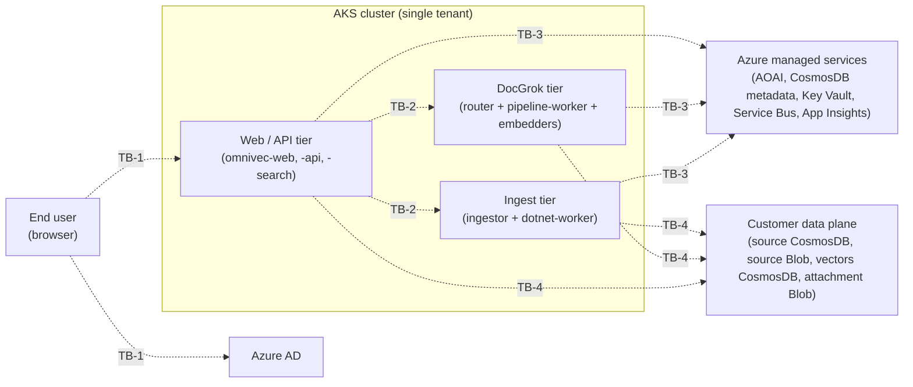

# OmniVec Threat Model

| Field | Value |
|---|---|
| Owner | OmniVec Team |
| Last reviewed | 2026-05-11 |
| Methodology | STRIDE-at-boundaries, manually identified (per DPSS / SQL Security Review Board guidance) |
| Companion artifact | [`threat-model.tm7`](./threat-model.tm7) — open in [Microsoft Threat Modeling Tool](https://aka.ms/threatmodelingtool); **TMT auto-threat-generation is intentionally disabled** (Settings → Disable Threat Generation) |
| Companion (CI/CD) | [`cicd-threat-model.md`](./cicd-threat-model.md) |
| Latest review notes | [`threat-model-review-2026-05.md`](./threat-model-review-2026-05.md) |

---

## 1. Scope

OmniVec is a **single-tenant** retrieval-augmented vector platform. One customer = one
AKS cluster + one set of Azure data-plane resources. The customer brings their own
source data (CosmosDB or Blob) and their own destination vector store; OmniVec runs
ingestion, embedding, and search inside the cluster.

**In scope for this threat model:**
- Cluster-internal services (web, api, search, ingestor, dotnet-worker, docgrok router/pipeline-worker, in-cluster embedders)
- Trust boundaries crossed by user, customer data, and Azure managed services
- Bootstrap/admin authentication and AAD integration
- Inter-component data plane

**Out of scope** (covered elsewhere or by other Microsoft policy):
- CI/CD supply chain — see [`cicd-threat-model.md`](./cicd-threat-model.md)
- Helm chart / Bicep infra threat model — tracked under `infra/`
- Code-level vulnerabilities (SQLi, XSS, etc.) — addressed by CodeQL / SAST / SDL
- Operational/SIEM ingestion design — handled by AppInsights consumer
- Customer-side hardening of *their* CosmosDB / Blob — customer responsibility

## 2. What we're working on (collapsed DFD)

Six logical zones across four trust boundaries. **Detailed 19-element view in [Appendix A](#appendix-a-detailed-dfd-19-elements).**



**Trust boundaries**

| Id | Boundary | Threat-model relevance |
|---|---|---|
| TB-1 | Internet ↔ AKS | Public web/api/search endpoints; AAD as identity provider |
| TB-2 | Inter-tier within cluster | Plain HTTP today, no NetworkPolicy; cross-tier compromise is the main lateral-movement path |
| TB-3 | AKS ↔ Azure managed services | Workload Identity Federation (HTTPS + AAD); not key-based |
| TB-4 | OmniVec ↔ customer data plane | Customer data is **untrusted**: schemas, attachment names, MIME types, blob URLs |

## 3. Assets

| Asset | Sensitivity | Where it lives |
|---|---|---|
| Customer document content | **High** (may be PII) | Customer Blob → AKS RAM (transient) |
| Vector embeddings of customer content | **High** (PII-derived; partially invertible) | Customer destination (`e2eblob.vectors`) |
| AOAI API keys (legacy) | **High** | `omnivec.metadata.docgrok_model.api_key` — being removed in favor of AAD |
| `OMNIVEC_ADMIN_TOKEN` | **High** | Pod env var; long-lived; breakglass-only after AAD migration |
| AAD JWT signing keys (JWKS) | High | Microsoft tenant — out of OmniVec control |
| Workload-identity federated credential | High | UAMI; rotated by AKS |
| Pipeline / model definitions | Medium | `omnivec.metadata` |
| Service Bus messages (blob URLs + IDs) | Medium | Service Bus |

## 4. What can go wrong (top 10 design threats)

Selected manually at boundary crossings. Risk rating uses the SDL scale: **Critical / Important / Moderate / Low / DefenseInDepth**. *Status*: ✅ shipped · ⚠️ partial · ❌ open.

| Id | Boundary | STRIDE | Threat | Risk | Status | Mitigation & residual |
|---|---|---|---|---|---|---|
| **T-API-1** | TB-1 → API | S/E/R | Static `OMNIVEC_ADMIN_TOKEN` replay grants full admin; no rotation, no per-call audit | **Important** | ✅ | AAD bearer + group→role mapping shipped (batch 2 + 4); admin token is now breakglass-only. Residual: token still exists; documented rotation runbook needed. |
| **T-MET-1** | TB-2 (router → cmeta) | I/T | AOAI API keys stored cleartext in `docgrok_model.api_key`; Cosmos breach exfiltrates keys | **Important** | ✅ | AAD-only model records (no `api_key`); `scripts/scrub_model_api_keys.py` purges legacy values. Residual: legacy fallback path still readable if ever populated. |
| **T-PWK-1** | TB-4 → pipeline-worker | D/E | Malicious customer document (PDF/Office/image) crashes parser or escapes via Pillow/PyMuPDF CVE; same address space as embedding HTTP client | **Important** | ⚠️ | Subprocess sandbox with `RLIMIT_AS`/`RLIMIT_CPU`/`RLIMIT_NOFILE` shipped behind `DOCGROK_PARSER_SANDBOX=1` (batch 4); page-cap 200. **Residual: full seccomp-bpf profile not yet enforced; flag default-off.** |
| **T-CON-2** | TB-4 → ingestor (SSRF) | T/I | Customer Cosmos attachment value points at attacker-controlled storage account; ingestor downloads it | **Important** | ✅ | Mandatory `attachment_blob_account_allowlist`; absolute URLs whose host doesn't match are rejected (batch 1). Residual: relies on operator config; misconfig = open. |
| **T-CON-1** | TB-2 (lease container) | T/D | Change-feed lease container shares Cosmos DB with metadata; cross-write can DoS or replay ingestion | **Moderate** | ✅ | Optional `LeaseCosmosEndpoint` / `LeaseCosmosDatabase` route lease to dedicated account (batch 4). Residual: not enabled by default. |
| **T-VEC-1** | TB-4 (data at rest) | I | Vectors are PII-derived and partially invertible (embedding-inversion attacks); residency / right-to-erasure obligations apply | **Moderate** | ✅ | Documented PII classification; `DELETE /api/sources/{id}/vectors` cascade-purge endpoint (batch 4). Residual: classification doc must propagate to customer-facing data agreements. |
| **T-RL-1** | TB-3 (router → AOAI) | D | One pipeline saturates AOAI tier RPM → 429 cascade starves other pipelines | **Moderate** | ✅ | Per-deployment embed semaphore (`OMNIVEC_EMBED_CONCURRENCY=4` default) + jittered exponential backoff (batch 1). Residual: no circuit-breaker yet. |
| **T-SRCH-1** | TB-1 → search | I/T | `omnivec-search` Service is type `LoadBalancer` on plain HTTP — query embeddings (PII per T-VEC-1) and bearer tokens travel in cleartext over public internet | **Important** | ❌ | **Open.** Front search behind the omnivec ingress with TLS, OR put it behind App Gateway / Front Door, OR switch service to ClusterIP + dedicated TLS ingress. |
| **T-NET-1** | TB-2 (in-cluster) | S/T/I | No `NetworkPolicy` in `helm/`; all in-cluster traffic plain HTTP on ClusterIP. A compromised pod can call any service unauth (no mTLS, no service mesh) | **Moderate** | ❌ | **Open.** Add default-deny `NetworkPolicy` per namespace + per-tier allow rules. mTLS/service-mesh is roadmap. |
| **T-SUP-1** | Pre-cluster (image source) | T | Compromised registry or MITM swaps an OmniVec image; cluster pulls and runs malicious code | **Moderate** | ⚠️ | Cosign keyless signing on every push (RES-3, batch 4 build pipeline); Helm template `cosign-policy.yaml` exists. **Residual: cluster admission verification (Ratify/Kyverno) not enforced by default — signature is generated but not yet checked at deploy.** |

> The CI/CD pipeline itself (the GitHub Actions runner that produces those signatures) has its own threat model in [`cicd-threat-model.md`](./cicd-threat-model.md).

## 5. What we did about it (mitigation backlog)

Open items only — closed items are the ✅ rows above.

| Threat | Action | Owner | ETA |
|---|---|---|---|
| T-SRCH-1 | Front `omnivec-search` behind shared ingress + TLS, or add dedicated TLS ingress; remove public LoadBalancer in default values | OmniVec | next batch |
| T-NET-1 | Author default-deny + per-tier `NetworkPolicy` for `omnivec` and `docgrok` namespaces | OmniVec | next batch |
| T-PWK-1 | Switch `DOCGROK_PARSER_SANDBOX` default to `1`; ship seccomp-bpf profile and require it via PSA `restricted` | DocGrok / OmniVec | next batch |
| T-SUP-1 | Add Ratify or Kyverno admission-controller chart that requires cosign signature on every OmniVec image | OmniVec | follow-up |
| T-API-1 (residual) | Document admin-token rotation runbook + deletion-after-AAD-cutover policy | OmniVec | follow-up |

## 6. Did we do enough? (review log)

| Date | Reviewer | Outcome | Notes |
|---|---|---|---|
| 2026-05-06 | Internal | Initial STRIDE-per-element pass | See `threat-model.md.bak` (pre-DPSS-refactor structure) |
| 2026-05-11 | Internal (DPSS-style refactor) | Trimmed to 10 boundary threats; collapsed DFD; surfaced T-SRCH-1, T-NET-1, T-SUP-1 from inter-component audit | Ready for SQL Security Review Board submission |

**To request a Threat Model Review:** upload `threat-model.tm7` + this `.md` via the Threat Modeling Portal ([aka.ms/dpgtrack](https://aka.ms/dpgtrack)). Per DPSS guidance, the review meeting is a 2–3 hour call; this document is sized to fit.

## 7. How to update this model

1. Edit this file. Diff is the source of truth; `.tm7` is the visualization.
2. If the architecture changes, update the collapsed DFD in §2 *and* the detailed DFD in [Appendix A](#appendix-a-detailed-dfd-19-elements).
3. Regenerate `.tm7` with `python scripts/gen_threat_model_tm7.py`.
4. Add new boundary threats to §4 with id `T-XXX-N` and a risk rating from the SDL scale.
5. Update §6 review log on every formal review or material refactor.

---

## Appendix A — Detailed DFD (19 elements)

The collapsed view in §2 hides per-pod detail. The full diagram below is the source for the `.tm7` artifact.

```mermaid
flowchart LR
  subgraph "INTERNET / AAD trust boundary"
    user["End-user browser"]
    aad["Azure AD<br/>(login.microsoftonline.com)"]
  end

  subgraph "AKS cluster (omnivec namespace)"
    subgraph "Web / API tier"
      web["omnivec-web<br/>(Next.js)"]
      api["omnivec-api<br/>(FastAPI)"]
      search["omnivec-search<br/>(Go)"]
    end
    subgraph "DocGrok tier"
      router["docgrok-router<br/>(Rust)"]
      pworker["docgrok-pipeline-worker"]
      incluster["in-cluster embedders<br/>CLIP / BGE / DSE-Qwen2"]
    end
    subgraph "Ingestor tier (.NET)"
      ingestor["omnivec-ingestor (.NET)<br/>change-feed watcher"]
      dotnetworker["omnivec-dotnet-worker<br/>(Service Bus consumer)"]
    end
  end

  subgraph "Azure managed services"
    aoai["Azure OpenAI"]
    cmeta["CosmosDB<br/>omnivec.metadata"]
    kv["Azure Key Vault"]
    sb["Azure Service Bus"]
    appinsights["Azure Monitor<br/>App Insights"]
  end

  subgraph "Customer-owned (external trust)"
    csrc["Customer CosmosDB<br/>(source w/ attachments)"]
    bsrc["Customer Blob source"]
    cvec["Customer CosmosDB<br/>(vectors destination)"]
    blob["Customer Blob<br/>(attachments source)"]
  end

  user -->|HTTPS + Bearer token| web
  user -->|HTTPS + Bearer token| api
  api -->|JWKS fetch (cached)| aad
  web --> api
  web --> search
  api --> cmeta
  api --> kv
  api --> sb
  api --> router
  search --> cvec
  search -->|/embed (query)| router
  search --> cmeta
  router -->|API key OR AAD| aoai
  router --> incluster
  router --> cmeta
  router --> pworker
  pworker --> sb
  pworker --> bsrc
  pworker -->|fetch attachment binary| blob
  pworker --> router
  pworker --> cvec
  ingestor -->|change-feed read| csrc
  ingestor -->|fetch attachment binary| blob
  ingestor -->|enumerate (azure-blob source)| bsrc
  ingestor -->|pipeline / source config read| cmeta
  ingestor -->|enqueue work (queue mode)| sb
  ingestor -->|"/embed/batch (inline mode)"| router
  ingestor -->|vector patch (inline mode)| csrc
  dotnetworker -->|drain SB topic| sb
  dotnetworker -->|"/embed/batch (queue mode)"| router
  dotnetworker -->|vector write| cvec
  dotnetworker -->|model record read| cmeta
  api -->|telemetry| appinsights
  search -->|telemetry| appinsights
  ingestor -->|telemetry| appinsights
  dotnetworker -->|telemetry| appinsights
```

## Appendix B — Prior STRIDE-per-element analysis (archive)

The previous version of this document (kept at `threat-model.md.bak` in the repo
working tree, also visible in git history before commit replacing it) contained
exhaustive STRIDE rows per process, per data store, and per external interactor.
That format was flagged by reviewers as **too detailed and lacking clarity from
a security-design standpoint** — most rows duplicated SDL/CodeQL coverage
rather than calling out boundary risks specific to OmniVec.

The 10 threats in §4 are the curated subset of those rows that represent
*design risk that STRIDE-at-boundaries surfaces and SDL/CodeQL does not*. If you
need the historical per-element matrix for context, see `threat-model.md.bak`.
